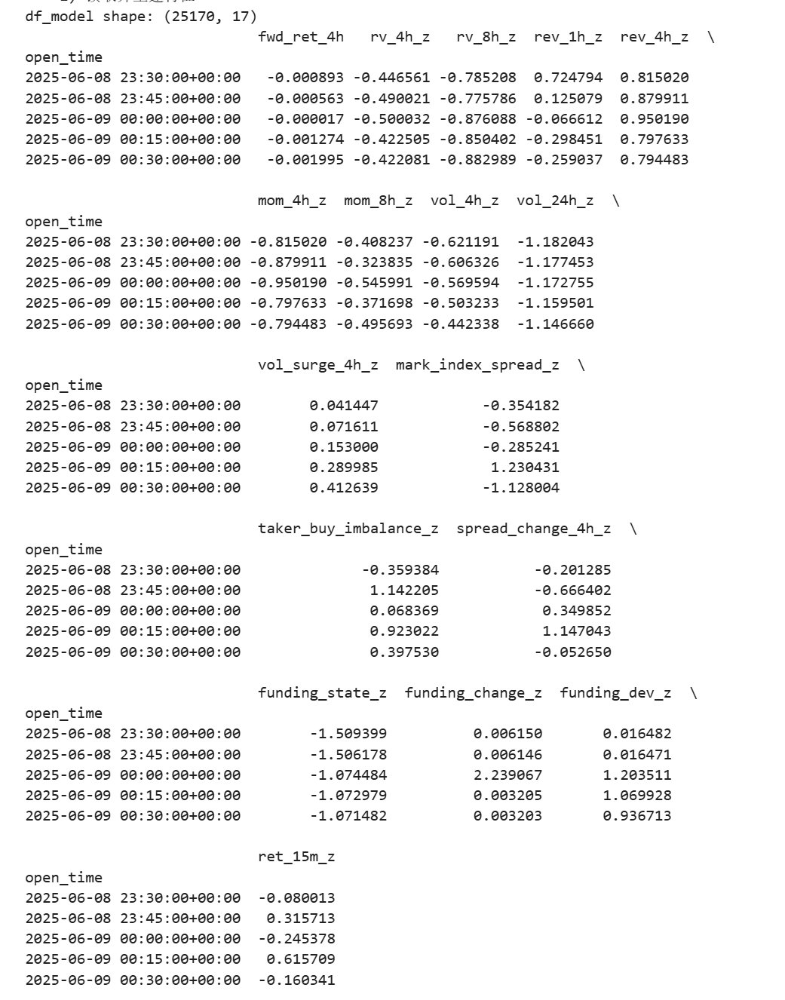
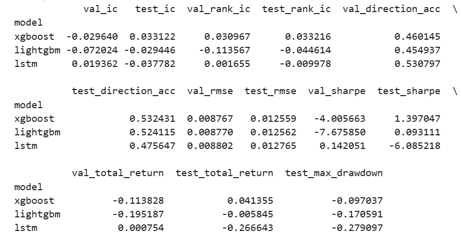
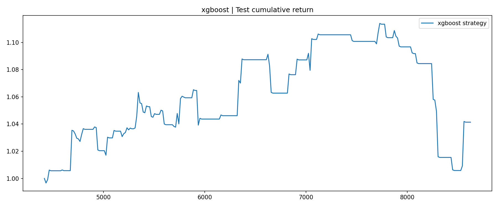
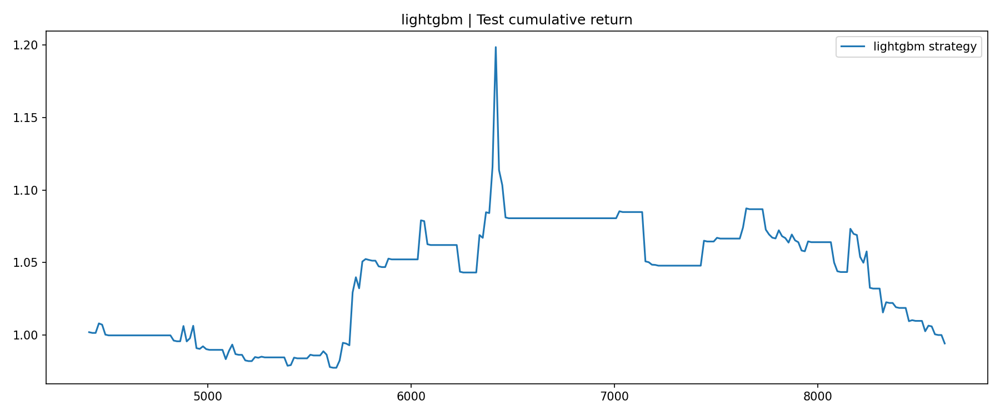
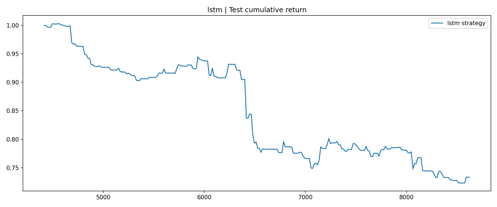

# BTCUSDT 15m Quant Research

基于 **BTCUSDT 15 分钟级别永续合约数据** 的量化研究项目。仓库分成两部分：

1. **Factor Research**：先做因子构建、单因子检验、候选组合验证，最后得到更稳健的双因子模型。  
2. **Model Comparison**：在相同数据区间和相同特征工程下，对 **LSTM / XGBoost / LightGBM** 三个模型做统一训练与样本外比较。

整个项目强调两件事：
- 必须使用 **train / validation / test** 的时间序列切分，避免未来信息泄露。
- 评价标准不只看预测误差，还要看 **IC、RankIC、方向准确率、手续费后的策略表现**。

---

## 1. Data

- Symbol: **BTCUSDT**
- Interval: **15m**
- Data range: **2025-06-01 ~ 2026-03-01**
- Train: **2025-06-01 ~ 2025-11-30**
- Validation: **2025-12-01 ~ 2026-01-15**
- Test: **2026-01-16 ~ 2026-02-28**

原始数据放在 `data/raw/`，支持 `csv` 或 `parquet`：
- `price_df`
- `mark_df`
- `index_df`
- `premium_df`
- `funding_df`

---

## 2. Part A: Factor Research

### 2.1 Research goal

先从波动率、反转、动量、量能、基差、订单流和资金费率偏离等维度构造候选因子，再通过单因子 IC、月度稳定性、分组收益和组合回测筛选更稳健的信号。

### 2.2 Final factor conclusion

研究中发现：
- **5 因子模型** 在 validation 上表现最好，但到了 test 阶段明显衰减。
- 真正能在样本外继续保留有效性的，主要是两个因子：
  - `vol_surge_4h`: 短期放量因子，正向使用
  - `mom_8h`: 8 小时动量因子，反向使用

最终保留的双因子模型为：

```text
score = 0.5 * vol_surge_4h_z_lag1 - 0.5 * mom_8h_z_lag1
```

### 2.3 Factor research figures

Validation 阶段最优双因子模型：


Final test 双因子模型：


Validation 阶段表现更强但样本外衰减的五因子模型：


---

## 3. Part B: LSTM / XGBoost / LightGBM Comparison

### 3.1 Target and features

预测目标为 **未来 4 小时收益率**：

```python
fwd_ret_4h = close.shift(-16) / close - 1
```

基础因子共 16 个，包括：
- 波动率：`rv_4h`, `rv_8h`
- 反转：`rev_1h`, `rev_4h`
- 动量：`mom_4h`, `mom_8h`
- 成交量：`vol_4h`, `vol_24h`, `vol_surge_4h`
- 基差与价差：`mark_index_spread`, `spread_change_4h`
- 订单流：`taker_buy_imbalance`
- 资金费率：`funding_state`, `funding_change`, `funding_dev`
- 短周期收益状态：`ret_15m`

所有基础特征都做 rolling z-score 标准化。

建模方式：
- **树模型**：对 16 个基础因子做 `[0, 1, 4, 16]` 的滞后展开，形成 `64` 个表格特征。
- **LSTM**：使用过去 `32` 根 15min bar 作为序列输入，对应 `8` 小时历史窗口。

### 3.2 Overfitting control

**XGBoost / LightGBM**
- 限制树深度
- 行采样 / 列采样
- L1 / L2 正则
- validation early stopping

**LSTM**
- 两层 LSTM + dropout
- AdamW + weight decay
- gradient clipping
- validation early stopping

### 3.3 Trading setup

- 调仓周期：`hold_bars = 16`，即每 4 小时调仓一次
- 手续费：`fee_bps = 5.0`，即单边 `5 bps = 0.05%`
- 非重叠持有：避免 4h 标签重叠导致回测失真
- 策略收益：`position * fwd_ret_4h - fee`

### 3.4 Final model comparison table

| model | val_ic | test_ic | val_rank_ic | test_rank_ic | val_direction_acc | test_direction_acc | val_rmse | test_rmse | val_sharpe | test_sharpe | val_total_return | test_total_return | test_max_drawdown |
|---|---:|---:|---:|---:|---:|---:|---:|---:|---:|---:|---:|---:|---:|
| xgboost | -0.029640 | 0.033122 | 0.030967 | 0.033216 | 0.460145 | 0.532431 | 0.008767 | 0.012559 | -4.005663 | 1.397047 | -0.113828 | 0.041355 | -0.097037 |
| lightgbm | -0.072024 | -0.029446 | -0.113567 | -0.044614 | 0.454937 | 0.524115 | 0.008770 | 0.012562 | -7.675850 | 0.093111 | -0.195187 | -0.005845 | -0.170591 |
| lstm | 0.019362 | -0.037782 | 0.001655 | -0.009978 | 0.530797 | 0.475647 | 0.008802 | 0.012765 | 0.142051 | -6.085218 | 0.000754 | -0.266643 | -0.279097 |

完整结果见：`results/model_compare_summary.csv`

### 3.5 Final conclusion

三模型比较里，**XGBoost 是最终最优模型**。主要原因：
- `test_ic = 0.033122`，三者中最好且为正
- `test_rank_ic = 0.033216`，排序能力最稳定
- `test_direction_acc = 0.532431`，方向判断优于 50%
- `test_sharpe = 1.397047`，显著优于另外两个模型
- `test_total_return = 4.1355%`，扣除手续费后仍为正收益
- `test_max_drawdown = -9.7037%`，回撤控制也更好

### 3.6 Model comparison figures

特征预览：



结果汇总：



指标对比图：


XGBoost 测试集累计收益曲线：



LightGBM 测试集累计收益曲线：



LSTM 测试集累计收益曲线：



---

## 4. Project Structure

```text
btcusdt-15m-factor-research/
├─ assets/
│  ├─ test_five_factor.png
│  ├─ test_two_factor.png
│  ├─ validation_five_factor_q60_40.png
│  ├─ validation_two_factor_q80_20.png
│  └─ model_compare/
│     ├─ feature_preview.png
│     ├─ results_summary.png
│     ├─ model_metric_comparison.png
│     ├─ xgboost_test_curve.png
│     ├─ lightgbm_test_curve.png
│     └─ lstm_test_curve.png
├─ config/
│  └─ project_config.example.json
├─ data/
│  └─ raw/
├─ outputs/
├─ results/
│  ├─ factor_decay.csv
│  ├─ final_summary.json
│  └─ model_compare_summary.csv
├─ scripts/
│  ├─ fetch_binance_futures_data.py
│  ├─ build_research_dataset.py
│  ├─ single_factor_research.py
│  ├─ validate_candidate_models.py
│  ├─ run_final_two_factor_model.py
│  ├─ 06_run_three_model_compare.py
│  └─ 07_plot_three_model_results.py
├─ src/
│  └─ btcusdt_15m_factor_research/
│     ├─ backtest_utils.py
│     ├─ data_pipeline.py
│     ├─ feature_engineering.py
│     ├─ research_utils.py
│     └─ model_compare/
│        ├─ config.py
│        ├─ data_pipeline.py
│        ├─ evaluation.py
│        ├─ models.py
│        ├─ plot_results.py
│        ├─ train_compare.py
│        └─ utils.py
├─ .gitignore
├─ pyproject.toml
└─ requirements.txt
```

---

## 5. How to Run

### 5.1 Install

```bash
pip install -r requirements.txt
pip install -e .
```

### 5.2 Factor research pipeline

```bash
python scripts/fetch_binance_futures_data.py --config config/project_config.example.json
python scripts/build_research_dataset.py --config config/project_config.example.json
python scripts/single_factor_research.py --config config/project_config.example.json
python scripts/validate_candidate_models.py --config config/project_config.example.json
python scripts/run_final_two_factor_model.py --config config/project_config.example.json
```

### 5.3 Three-model comparison pipeline

```bash
python scripts/06_run_three_model_compare.py --raw-dir data/raw --output-dir outputs
python scripts/07_plot_three_model_results.py --output-dir outputs --summary-csv results/model_compare_summary.csv --figure-dir assets/model_compare
```

> 说明：仓库中已经放入本次实验生成的结果图和结果表；重新运行脚本后，你可以用自己的最新结果覆盖这些文件。

---

## 6. Notes

- 因子研究部分的最终结论是：**简化后的双因子模型比更复杂的五因子模型更稳健**。
- 三模型比较部分的最终结论是：**在本次样本与特征设定下，XGBoost 明显优于 LightGBM 和 LSTM**。
- 这个仓库更偏向研究原型，不是可直接上线的实盘系统；下一步更适合做滑点建模、滚动重训练、不同市场阶段鲁棒性测试和仓位管理。
